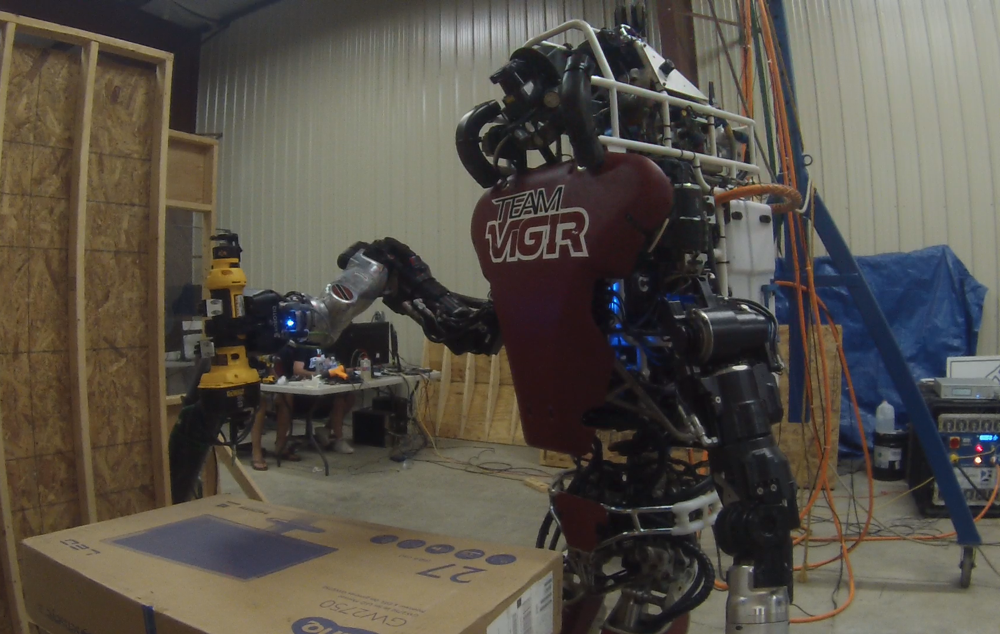

## Reactive High-level Behavior Synthesis for an Atlas Humanoid Robot

Paper submission to ICRA 2016. Accepted for publication.

Spyros Maniatopoulos, Philipp Schillinger, Vitchyr Pong, David C. Conner, and Hadas Kress-Gazit

IEEE International Conference on Robotics and Automation (ICRA 2016), Stockholm, Sweden, May 2016

Click on the image above to watch the video accompanying this paper.
